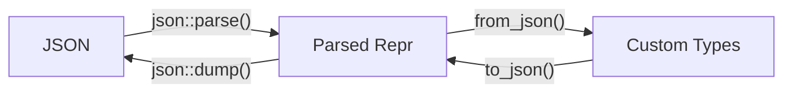

# Arcitectural Decision Record 009: JSON and JSON-Schema Support Libraries for C++ 

## Decisions
Projects may use *nlohmann-json* and *Valijson*. These libraries are an alternative to EcKit's existing JSON support. We chose this combination for its YAML validation potential and regex engine flexibility, see [Comparison of Solutions](#comparison-of-solutions) for detail.

Follow the [Usage Guidelines](#usage-guidelines) below.

Stack-dependencies provides *nlohmann-json* and *Valijson*.

## Context
Multiple production-grade open-source JSON libraries are now available. We no longer need to maintain our own JSON parsing in eckit. We also want JSON-Schema v7 support, which our current stack lacks.

### Landscape of Available Libraries

#### JSON Parsing Libraries Overview
Many JSON parsing libraries exist, varying widely in popularity and activity. The list below is by no means exhaustive but aims to capture most well-known libraries.

| Library       | JSON Schema |                          Source                          |                                  License                                  |                                 Remarks                                  |
| ------------- | :---------: | :------------------------------------------------------: | :-----------------------------------------------------------------------: | :----------------------------------------------------------------------: |
| nlohmann-json |      ❌      |        [GitHub](https://github.com/nlohmann/json)        |     [MIT](https://github.com/nlohmann/json/blob/develop/LICENSE.MIT)      |                                                                          |
| Boost.JSON    |      ❌      |        [GitHub](https://github.com/boostorg/json)        | [BSL 1.0](https://github.com/boostorg/json/blob/develop/LICENSE_1_0.txt)  |                                                                          |
| jsoncons      |      ✅      |   [GitHub](https://github.com/danielaparker/jsoncons)    | [BSL 1.0](https://github.com/danielaparker/jsoncons/blob/master/LICENSE)  | Most complete library of this list.<br>Supports much more than just JSON |
| simdjson      |      ❌      |      [GitHub](https://github.com/simdjson/simdjson)      |  [Apache 2.0](https://github.com/simdjson/simdjson/blob/master/LICENSE)   |                          Designed for raw speed                          |
| RapidJson     |      ✅      |      [GitHub](https://github.com/Tencent/rapidjson)      |    [MIT](https://github.com/Tencent/rapidjson/blob/master/license.txt)    |                            Last release 2016                             |
| JsonCpp       |      ❌      | [GitHub](https://github.com/open-source-parsers/jsoncpp) | [MIT](https://github.com/open-source-parsers/jsoncpp/blob/master/LICENSE) |                             Maintenance Mode                             |

#### JSON Schema Libraries Overview

[json-schema.org](https://json-schema.org/tools) lists the following non-obsolete C++ libraries:

| Name                  |     Supported Dialect     |         License         |                           Source                            |                                 Bowtie Report                                  |
| --------------------- | :-----------------------: | :---------------------: | :---------------------------------------------------------: | :----------------------------------------------------------------------------: |
| Blaze                 | 4, 6, 7, 2019-09, 2020-12 | AGPL-3.0 and Commercial |        [Source](https://github.com/sourcemeta/blaze)        |  [Report](https://bowtie.report/#/implementations/cpp-blaze "See at Bowtie")   |
| f5-json-schema        |             7             |         BSL-1.0         |       [Source](https://github.com/hotkit/json-schema)       | [Report](https://bowtie.report/#/implementations/cpp-valijson "See at Bowtie") |
| json-schema-validator |             7             |           MIT           | [Source](https://github.com/pboettch/json-schema-validator) |                                      N/A                                       |
| jsoncons              | 4, 6, 7, 2019-09, 2020-12 |         BSL-1.0         |     [Source](https://github.com/danielaparker/jsoncons)     | [Report](https://bowtie.report/#/implementations/cpp-jsoncons "See at Bowtie") |
| Valijson              |             7             |      BSD-2-Clause       |     [Source](https://github.com/tristanpenman/valijson)     | [Report](https://bowtie.report/#/implementations/cpp-valijson "See at Bowtie") |

#### Analysis

This section analyzes each library individually, then compares viable combinations. JSON Schema feature comparison uses the [Bowtie Report](https://bowtie.report/#/), a benchmark to track how well implementations follow the JSON schema specification.

##### nlohmann-json

This is the most popular JSON parsing library for C++ on GitHub with almost 50k Stars. The library focuses on usability while maintaining reasonable performance and memory consumption. A natural choice for us because we already rely on it as a transitive dependency of PROJ.

##### Boost.JSON

Included for completeness. We do not want to deal with adding boost to our builds. Boost.JSON has a clean and readable API. Documentation is terse as with many boost libraries. 

##### jsoncons

Most complete library on this list with support for JSON-Patch, Pointer, Path, Schema. Supports additional formats, BSON, CBOR, msgpack and TOML. Supports all revisions of the JSON-Schema format.

##### simdjson

Read-only support. Designed for high-speed parsing. When searching for JSON libraries for C++ *simdjson* will show up but it does not fit our use case.

##### RapidJson

Still often recommended but no release in almost 10 years. Last release contains many bugs that are easily encountered, can be used from a master build. Project looks mostly abandoned.

##### JsonCpp

Library description explicitly states that it aims to support legacy C++ development with JsonCpp. Library is in maintenance mode and only applies bug fixes. No additional features are accepted. Similar API but no support for JSON Path or Pointer. 

##### Blaze

Blaze is the most complete solution for JSON Schema validation according to the Bowtie report and self reports the best performance, see [paper](https://arxiv.org/pdf/2503.02770). Blaze is dual-licensed under AGPL and commercial. AGPL creates major complications with respect to distribution, therefore *Blaze* cannot be considered.

##### f5-json-schema

This is a pure JSON schema library. The project is referenced in a few benchmarks but it looks mostly abandoned. Last release was 6 years ago.

##### json-schema-validator

This library builds on top of *nlohmann-json*. *Nlohmann-json* is already a transitive dependency via PROJ, making this a natural candidate. We have not yet approved *nlohmann-json* for general use. There is no Bowtie report available for *json-schema-validator*, however the library author reports all required tests from [JSON-Schema-Test-Suite](https://github.com/json-schema-org/JSON-Schema-Test-Suite) pass.

##### Valijson

Valijson's adapter architecture lets it work with different JSON parsers and regex engines. The library ships with a couple of adapters but users can write their own adapters. There is an adapter available for *yaml-cpp* demonstrating how YAML can be validated. Current release requires C++17; version 1.2 onwards requires C++20.

#### Comparison of Solutions

Three viable combinations emerged and are compared in the listing below.

| Solution                              | Merit                                                                                                                                                                                        | Demerit                                                                              |
| ------------------------------------- | -------------------------------------------------------------------------------------------------------------------------------------------------------------------------------------------- | ------------------------------------------------------------------------------------ |
| jsoncons                              | Single library solution. Active development. Brings additional backends. Supports all versions of JSON schema.                                                                                | Cannot use a different regex engine than std::regex.                                 |
| nlohmann-json + json-schema-validator | nlohmann-json is widely used and active in development. json-schema-validator is specific to nlohmann-json.                                                                                 | Cannot use a different regex engine than std::regex.<br>Only supports JSON schema v7 |
| nlohmann-json + valijson              | nlohmann-json is widely used and active in development. valijson is agnostic towards the used json parsing library. May validate YAML with JSON schema.<br>Can use different regex engines. | Only supports JSON schema v7                                                         |

*nlohmann-json* with *valijson* is the solution with the largest potential impact. This combination addresses all needs for JSON and both libraries exhibit active development and wide adoption. Beyond JSON: YAML is currently much more widely used than JSON and we are missing a validation library for YAML. This combination allows us to address this shortcoming as well.

## Related Decisions

None

## Consequences

### Usage Guidelines

Keep JSON parsing and validation code separate from your application logic. Create domain types mapping from JSON types to C++ structs, see [Type Mapping JSON to C++](#type-mapping-json-to-c).

**Code Separation**


Let your application or library code work only on domain objects deserialized from JSON. Provide free functions to serialize and deserialize from parsed representation \(`json::object`\) into your domain types. E.g., provide `to_json`/`from_json`.

#### Type Mapping JSON to C++

| JSON type               | JSON Schema                                                                    | C++ type                             | Notes                                                                                                                                                                  |
| ----------------------- | ------------------------------------------------------------------------------ | ------------------------------------ | ---------------------------------------------------------------------------------------------------------------------------------------------------------------------- |
| `object` (known keys)   | `"type": "object"` with `"properties"`                                         | `struct`                             | One member per property. Prefer structs over classes — public by default, no boilerplate.                                                                              |
| `object` (dynamic keys) | `"type": "object"` with `"additionalProperties"` or `"patternProperties"` only | `std::unordered_map<std::string, T>` | Only when keys are genuinely unknown at compile time (e.g., locale maps, feature flags).                                                                               |
| `array`                 | `"type": "array"`                                                              | `std::vector<T>`                     | Contiguous memory, cache-friendly. Use `std::array<T, N>` only for fixed-size tuples (`minItems == maxItems`).                                                         |
| `array` (unique)        | `"type": "array"`, `"uniqueItems": true`                                       | `std::vector<T>`                     | Prefer vector over `std::set` — uniqueness is already enforced by the schema validator. Use `std::set<T>` only if you need fast lookup by value after deserialization. |
| `string`                | `"type": "string"`                                                             | `std::string`                        |                                                                                                                                                                        |
| `string` (enum)         | `"type": "string"`, `"enum": [...]`                                            | `enum class`                         | Map at deserialization time. Keeps invalid values out of your logic entirely.                                                                                          |
| `number`                | `"type": "number"`                                                             | `double`                             | IEEE 754 double. Use `float` only if memory/bandwidth constrained and precision loss is acceptable.                                                                    |
| `integer`               | `"type": "integer"`                                                            | `int64_t`                            | Covers the full JSON integer range. Use `int32_t` or `uint32_t` only when the schema's `minimum`/`maximum` guarantee it fits.                                          |
| `boolean`               | `"type": "boolean"`                                                            | `bool`                               |                                                                                                                                                                        |
| `null`                  | `"type": "null"`                                                               | —                                    | Rarely used alone. See nullable below.                                                                                                                                 |
| nullable                | `"type": ["string", "null"]` etc.                                              | `std::optional<T>`                   | For fields that can be explicitly `null` or are not required by the schema.                                                                                            |
| union type              | `"type": ["integer", "string"]`                                                | `std::variant<int64_t, std::string>` | For fields where multiple non-null types are valid. Rare in practice.                                                                                                  |
| optional field          | not in `"required"`                                                            | `std::optional<T>`                   | Absent fields deserialize to `std::nullopt`.                                                                                                                           |

### Example

**Schema:**

```json
{
  "$schema": "http://json-schema.org/draft-07/schema#",
  "title": "Player",
  "type": "object",
  "required": ["name", "age", "rating", "rank", "stats"],
  "properties": {
    "name": {
      "type": "string",
      "minLength": 1
    },
    "age": {
      "type": "integer",
      "minimum": 0
    },
    "rating": {
      "type": "number"
    },
    "rank": {
      "type": "string",
      "enum": ["bronze", "silver", "gold"]
    },
    "nickname": {
      "type": "string"
    },
    "stats": {
      "type": "object",
      "required": ["wins", "losses", "avg_score"],
      "properties": {
        "wins": {
          "type": "integer",
          "minimum": 0
        },
        "losses": {
          "type": "integer",
          "minimum": 0
        },
        "avg_score": {
          "type": "number"
        }
      },
      "additionalProperties": false
    }
  },
  "additionalProperties": false
}
```

**Valid JSON input:**

```json
{
  "name": "Alice",
  "age": 28,
  "rating": 4.7,
  "rank": "gold",
  "nickname": "ace",
  "stats": {
    "wins": 142,
    "losses": 37,
    "avg_score": 87.3
  }
}
```


```cpp
// ---------------------------------------------------------------------------
// Domain types
// ---------------------------------------------------------------------------

enum class Rank { bronze, silver, gold };

// Provide custom converters for Enum <-> String conversion 
static Rank rank_from_string(const std::string& s)
{
    if (s == "silver") return Rank::silver;
    if (s == "gold")   return Rank::gold;
    return Rank::bronze;
}

static const char* rank_to_string(Rank r)
{
    switch (r) {
        case Rank::bronze: return "bronze";
        case Rank::silver: return "silver";
        case Rank::gold:   return "gold";
    }
    return "unknown";
}

struct Stats {
    int64_t wins = 0;
    int64_t losses = 0;
    double avg_score = 0.0;
};

struct Player {
    std::string name;
    int64_t age = 0;
    double rating = 0.0;
    Rank rank = Rank::bronze;
    std::optional<std::string> nickname;
    Stats stats;
};

// For simplicity's sake Stats is included here
static Player player_from_json(const json& j)
{
    Player p;
    p.name   = j.at("name").get<std::string>();
    p.age    = j.at("age").get<int64_t>();
    p.rating = j.at("rating").get<double>();
    p.rank   = rank_from_string(j.at("rank").get<std::string>());
    if (j.contains("nickname"))
        p.nickname = j.at("nickname").get<std::string>();
    const auto& s = j.at("stats");
    p.stats.wins      = s.at("wins").get<int64_t>();
    p.stats.losses    = s.at("losses").get<int64_t>();
    p.stats.avg_score = s.at("avg_score").get<double>();
    return p;
}

static json player_to_json(const Player& p)
{
    json j = {
        {"name", p.name},
        {"age", p.age},
        {"rating", p.rating},
        {"rank", rank_to_string(p.rank)},
        {"stats", {
            {"wins", p.stats.wins},
            {"losses", p.stats.losses},
            {"avg_score", p.stats.avg_score}
        }}
    };
    if (p.nickname)
        j["nickname"] = *p.nickname;
    return j;
}


// ---------------------------------------------------------------------------
// Helpers
// ---------------------------------------------------------------------------

static json load_json(const std::string& path)
{
    std::ifstream ifs(path);
    if (!ifs)
        throw std::runtime_error("Cannot open file: " + path);
    return json::parse(ifs);
}

static bool validate_file(const valijson::Schema& schema,
                          const std::string& path)
{
    std::cout << "--- Validating: " << path << " ---\n";

    json data = load_json(path);
    valijson::adapters::NlohmannJsonAdapter adapter(data);
    valijson::Validator validator{};
    valijson::ValidationResults results;
    bool valid = validator.validate(schema, adapter, &results);

    if (valid)
    {
        std::cout << "Result: VALID\n\n";
    }
    else
    {
        std::cout << "Result: INVALID (" << results.numErrors() << " error(s))\n";
        valijson::ValidationResults::Error error;
        while (results.popError(error))
        {
            std::cout << "  " << error.jsonPointer << ": "
                      << error.description << "\n";
        }
        std::cout << "\n";
    }

    return valid;
}

int main(int argc, char* argv[])
{
    if (argc < 3)
    {
        std::cerr << "Usage: " << argv[0] << " <schema.json> <data.json> [data2.json ...]\n";
        return 1;
    }

    try
    {
        json schema_doc = load_json(argv[1]);
        valijson::adapters::NlohmannJsonAdapter schema_adapter(schema_doc);

        valijson::Schema schema;
        valijson::SchemaParser parser;
        parser.populateSchema(schema_adapter, schema);

        for (int i = 2; i < argc; ++i)
            validate_file(schema, argv[i]);

        // Serde demo: if exactly one data file and it validates, show round-trip
        if (argc == 3) {
            std::cout << "=== Serde: valijson + nlohmann/json (manual) ===\n\n";

            if (!validate_file(schema, argv[2]))
            {
                std::cout << "Skipping deserialization (invalid data)\n\n";
                return 1;
            }

            // Deserialize into domain types
            json data = load_json(argv[2]);
            Player player = player_from_json(data);

            std::cout << "Deserialized Player:\n";
            print_player(player);

            // Serialize back to JSON
            json roundtrip = player_to_json(player);
            std::cout << "\nSerialized back to JSON:\n"
                      << roundtrip.dump(2) << "\n\n";
        }
            
    }
    catch (const std::exception& e)
    {
        std::cerr << "Error: " << e.what() << "\n";
        return 1;
    }

    return 0;
}
```

### Synergy with YAML

JSON schema can express the expected structure of a YAML file. A common way to do this is to `parse yaml -> generate json -> validate json`. This works but loses exact error location information as line, column of parsing error. Valijson already provides an adapter for *yaml-cpp*. We can use this as an example to provide our own adapter once we pick a parsing library for YAML.

Be aware that YAML is not strictly a superset of JSON. Beyond rare UTF-16 edge cases, three common incompatibilities exist:
- Reused keys are valid in JSON but invalid in YAML, e.g., `{"a": 1, "a": 2}`.
- Tab-indented JSON documents are not valid in YAML.
- A singular scalar is a valid JSON document but not a valid YAML, e.g., `42`.
## References

### Specifications

- [RFC 8259 — The JavaScript Object Notation (JSON) Data Interchange Format](https://datatracker.ietf.org/doc/html/rfc8259)
- [JSON Schema Draft-07](https://json-schema.org/draft-07/json-schema-release-notes)
- [YAML 1.2.2 Specification](https://yaml.org/spec/1.2.2/)

### Tools and Reports

- [json-schema.org — Implementations](https://json-schema.org/tools)
- [Bowtie — JSON Schema Implementation Report](https://bowtie.report/#/)
- [JSON-Schema-Test-Suite](https://github.com/json-schema-org/JSON-Schema-Test-Suite)

### JSON Parsing Libraries

- [nlohmann-json](https://github.com/nlohmann/json)
- [Boost.JSON](https://github.com/boostorg/json)
- [jsoncons](https://github.com/danielaparker/jsoncons)
- [simdjson](https://github.com/simdjson/simdjson)
- [RapidJSON](https://github.com/Tencent/rapidjson)
- [JsonCpp](https://github.com/open-source-parsers/jsoncpp)

### JSON Schema Libraries

- [Blaze](https://github.com/sourcemeta/blaze) — see also [performance paper](https://arxiv.org/pdf/2503.02770)
- [f5-json-schema](https://github.com/hotkit/json-schema)
- [json-schema-validator](https://github.com/pboettch/json-schema-validator)
- [Valijson](https://github.com/tristanpenman/valijson)

## Authors

- Kai Kratz

---
> *Write the ADR, 
> Schemas snap into order; 
> Hope! No more sorrow*
> 🪷🧘🪷
> ~ Kai
 
