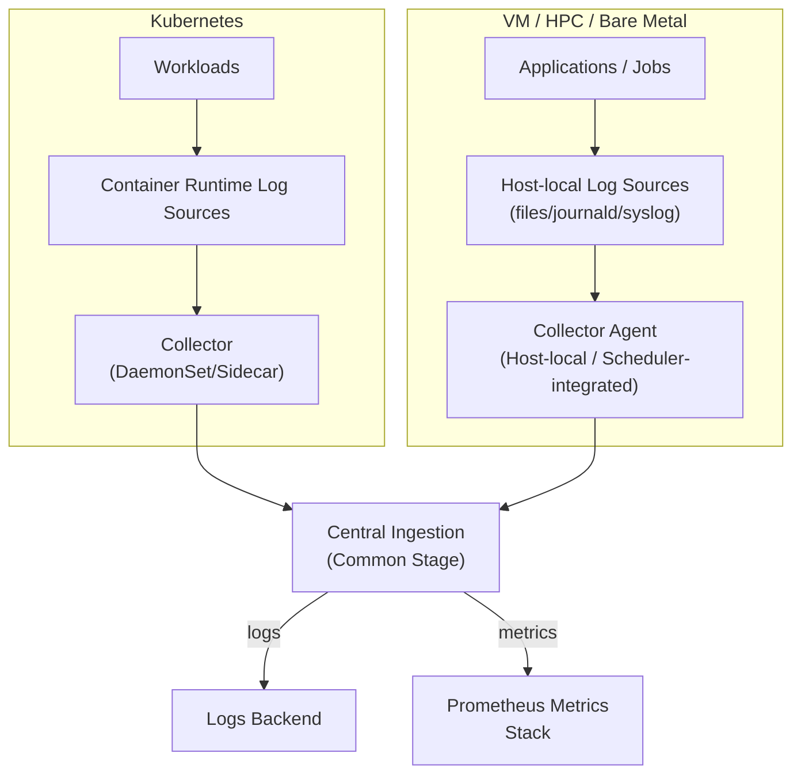

# ECMWF Observability Guidelines

<!-- markdownlint-configure-file
{"MD013":{"code_blocks":false,"tables":false}}
-->

## Table of Contents

- [1. Purpose and Scope](#1-purpose-and-scope)
- [2. Core Principles](#2-core-principles)
  - [2.1 Normative Language](#21-normative-language)
- [3. Platform Context](#3-platform-context)
  - [3.1 High-Level Collection Strategy](#31-high-level-collection-strategy)
  - [3.2 Log Access and Ownership](#32-log-access-and-ownership)
  - [3.3 Log Retention and Archival](#33-log-retention-and-archival)
  - [3.4 Telemetry Outage and Recovery](#34-telemetry-outage-and-recovery)
- [4. Logging Standard](#4-logging-standard)
  - [4.1 Log Event Model](#41-log-event-model)
  - [4.2 Required Fields (Minimum Contract)](#42-required-fields-minimum-contract)
  - [4.3 Event Naming and Attribute Cardinality](#43-event-naming-and-attribute-cardinality)
  - [4.4 Library vs Binary Application Logging](#44-library-vs-binary-application-logging)
  - [4.5 Good and Bad Log Lines](#45-good-and-bad-log-lines)
    - [4.5.1 Trace Correlation Fields (`traceId` and `spanId`)](#451-trace-correlation-fields-traceid-and-spanid)
    - [4.5.2 Correlation Identifiers (`traceId`, `request.id`, `job.id`)](#452-correlation-identifiers-traceid-requestid-jobid)
  - [4.6 Severity and Event Design](#46-severity-and-event-design)
  - [4.7 Exception and Error Logging](#47-exception-and-error-logging)
  - [4.8 Safety and Compliance Rules](#48-safety-and-compliance-rules)
  - [4.9 Common Anti-Patterns](#49-common-anti-patterns)
  - [4.10 Validation Checklist and Ownership](#410-validation-checklist-and-ownership)
  - [4.11 Legacy Compatibility and Migration](#411-legacy-compatibility-and-migration)
- [5. Metrics Standard](#5-metrics-standard)
  - [5.1 Scope and Standard](#51-scope-and-standard)
  - [5.2 References](#52-references)
  - [5.3 Metric Types and Usage](#53-metric-types-and-usage)
  - [5.4 Naming Conventions](#54-naming-conventions)
  - [5.5 Labels and Cardinality](#55-labels-and-cardinality)
  - [5.6 Required Baseline Metrics](#56-required-baseline-metrics)
  - [5.7 Histogram Guidance](#57-histogram-guidance)
  - [5.8 Good and Bad Metric Examples](#58-good-and-bad-metric-examples)
  - [5.9 Validation Checklist and Ownership](#59-validation-checklist-and-ownership)

## 1. Purpose and Scope

This document defines the ECMWF baseline for observability across software and services.

Current scope:

- Defines common expectations for observability signals.
- Defines logging and metrics standardisation.
- Covers all deployment contexts at a principle level:
  - Kubernetes
  - Virtual machines (VMs)
  - HPC
  - Bare metal servers
  - Remote data-mover hosts

Out of scope in this version:

- Detailed environment-specific collection pipelines and agent deployment patterns.
- Full tracing specification (to be defined in a later revision).

## 2. Core Principles

- Use consistent observability conventions across all ECMWF software.
- Prefer machine-parseable telemetry over free-form text.
- Keep telemetry actionable and low-noise.
- Correlate signals where possible (for example, include trace/span
  identifiers in logs when available).
- Protect sensitive data by design (no credentials, tokens, or personal data
  in logs/metrics/traces).

### 2.1 Normative Language

The keywords `MUST`, `SHOULD`, and `MAY` are used as requirement levels:

- `MUST`: mandatory requirement for compliance.
- `SHOULD`: recommended default; deviations require justification.
- `MAY`: optional behavior.

## 3. Platform Context

ECMWF software runs in multiple environments:

- Kubernetes clusters
- Virtual machines
- HPC systems
- Bare metal servers
- Remote data-mover hosts

This document focuses on common logs and metrics structure plus application
emission rules. Environment-specific collection design for Kubernetes, VMs,
HPC, bare metal, and remote data-mover hosts will be specified later.

### 3.1 High-Level Collection Strategy

The collection pipeline is part of the deployment environment and MUST be
considered in service design.

- Kubernetes workloads:
  - Platform Engineering Team deploys and operates OpenTelemetry collectors.
  - Application stdout/stderr is captured by the container runtime into node
    log files (or equivalent runtime log sources), and collectors read/tail
    those sources.
  - Metrics/traces are collected via SDK/exporter endpoints or local agents,
    depending on service design.
- VM, HPC, and bare-metal workloads (including remote data-mover hosts):
  - Applications/jobs write logs to host-local logging sources (for example
    files, journald, or syslog), and host-local or scheduler-integrated
    collectors read from those sources.
  - Metrics/traces are collected via local endpoints/agents where enabled.
- Central ingestion (common stage for all environments):
  - Receives telemetry from Kubernetes and VM/HPC/bare-metal collection paths.
  - Routes logs to the central ECMWF logging backend.
  - Routes metrics to the central Prometheus-compatible metrics stack.



### 3.2 Log Access and Ownership

Access to production logs is a service onboarding requirement and MUST be
defined explicitly for each service and environment (Kubernetes, VM, HPC,
bare metal, and remote data-mover hosts).

Minimum governance requirements:

- Access path MUST be documented (for example central logging UI/API and,
  where required for resilience, approved host-local access method).
- Access roles MUST be defined and approved by service owner and operations.
- Access MUST be granted through managed team groups.
- Access provisioning and access changes MUST follow the standard IAM
  approval and logging process.
- Emergency access procedure MUST be documented, including allowed methods
  during central logging outage (for Kubernetes, controlled use of
  `kubectl logs`; for VM/HPC/bare metal, approved host-local log access).
  Emergency access MUST be time-limited and linked to an active incident.

Ownership model:

| Control | Development Team | Platform Engineering Team | Production Team |
| --- | --- | --- | --- |
| Define service log access requirements | MUST | SHOULD review feasibility | MUST review operational fit |
| Implement central access controls (RBAC/SSO/groups) | N/A | MUST | SHOULD validate |
| Approve and periodically review access lists | MUST | SHOULD support automation | MUST |
| Maintain emergency access runbook | SHOULD contribute service context | SHOULD provide platform procedure | MUST own operational procedure |

### 3.3 Log Retention and Archival

Log retention requirements MUST be defined for each service and environment
at onboarding and reviewed during major service changes.

Retention model:

- A default retention period MUST be provided by the central logging service.
- Service-specific retention overrides MAY be requested with justification.
- Long-term archival requirements (beyond central retention) MUST be declared
  by the service owner and approved by operations.

Ownership model:

| Control | Development Team | Platform Engineering Team | Production Team |
| --- | --- | --- | --- |
| Declare required retention and archival period | MUST | SHOULD review feasibility | MUST review operational fit |
| Implement retention in central logging platform | N/A | MUST | SHOULD validate production coverage |
| Implement and operate long-term archival pipeline | N/A | SHOULD support platform integration | MUST |
| Periodically review retention settings and costs | SHOULD | MUST provide platform metrics | MUST |

### 3.4 Telemetry Outage and Recovery

Observability design MUST include degraded-mode behavior for periods when
central telemetry ingestion is unavailable.

Minimum requirements:

- Applications MUST continue emitting telemetry signals locally during central
  outage:
  - logs to a local, accessible sink (stdout/stderr, file, or system logger);
  - metrics via a local scrape/export endpoint or host-local collector path;
  - traces to a local collector/agent where tracing is enabled.
- Collection/forwarding components SHOULD buffer locally and retry delivery
  when connectivity or backend availability is restored.
- Backfill after recovery MUST be supported where buffering exists.
- Known telemetry coverage gaps MUST be detectable and reported to operations.
- Services and runbooks MUST define how urgent logs are retrieved during
  outage using documented emergency access methods.

Ownership model:

| Control | Development Team | Platform Engineering Team | Production Team |
| --- | --- | --- | --- |
| Ensure service emits local telemetry in degraded mode | MUST | SHOULD provide guidance | SHOULD validate in production |
| Provide buffering/retry/backfill capability in pipeline | N/A | SHOULD | MUST validate operational readiness |
| Detect and report ingestion coverage gaps | SHOULD emit health signals | MUST provide platform-level detection | MUST monitor and escalate |
| Maintain outage and recovery runbook | SHOULD contribute service behavior | SHOULD contribute platform behavior | MUST own incident operation |

## 4. Logging Standard

ECMWF software SHOULD emit structured logs aligned with the OpenTelemetry
log data model.

Useful references:

- OpenTelemetry logs data model: <https://opentelemetry.io/docs/specs/otel/logs/data-model/>
- OpenTelemetry semantic conventions: <https://opentelemetry.io/docs/specs/semconv/>

### 4.1 Log Event Model

Each log event MUST provide the following information, either directly in the
record or via stable resource/context enrichment in the pipeline:

- A clear event message (`body` / message).
- Severity (`severityText`, `severityNumber`).
- Timestamp in UTC.
- Stable resource attributes (service and environment metadata).
- Context attributes for debugging and operations.

Canonical structure (OpenTelemetry-aligned):

```json
{
  "timestamp": "2026-02-11T12:20:43Z",
  "traceId": "7f3fbbf5b8f24f32a59ec8ef9b264f93",
  "spanId": "f9c3a29d03ef154f",
  "severityText": "INFO",
  "severityNumber": 9,
  "body": "Operation completed",
  "resource": {
    "service.name": "example-service",
    "service.version": "1.0.0",
    "deployment.environment": "prod",
    "k8s.namespace.name": "default",
    "k8s.pod.name": "example-service-7f8b66f9f7-rj8vd"
  },
  "attributes": {
    "event.name": "data.transfer.completed",
    "request.id": "req-8f31c9",
    "job.id": "job-42a7"
  }
}
```

### 4.2 Required Fields (Minimum Contract)

All production logs MUST include the following fields.

The minimum contract applies to the effective log event at query/analysis
time. Fields MAY be set directly by the application or added by approved
collector/pipeline enrichment, provided values are stable and correct.

LogRecord fields (top-level in the log record):

| Field | Requirement | Notes |
| --- | --- | --- |
| `timestamp` | MUST | UTC, RFC 3339 / ISO-8601 format |
| `severityText` | MUST | `TRACE`, `DEBUG`, `INFO`, `WARN`, `ERROR`, `FATAL` |
| `severityNumber` | MUST | Numeric OTel-compatible severity |
| `body` | MUST | Human-readable message describing one event |
| `traceId` | MUST when available | Enables log-trace correlation; not required for startup, housekeeping, or other non-request events |
| `spanId` | MUST when available | Enables log-trace correlation |

Resource attributes (nested inside the `resource` block):

| Field | Requirement | Notes |
| --- | --- | --- |
| `service.name` | MUST | Logical service/application name |
| `service.version` | MUST | Deployed version/build identifier |
| `deployment.environment` | SHOULD | e.g. `dev`, `test`, `staging`, `prod`; may not be known by the application at runtime |

Collector-enriched or infrastructure fields:

| Field | Requirement | Notes |
| --- | --- | --- |
| `host.name` | MUST (VM/HPC context) | May be emitted by app or added by collector/resource detection |
| `k8s.namespace.name` | MUST (K8s context) | May be added at collection layer |
| `k8s.pod.name` | MUST (K8s context) | May be added at collection layer |

Recommended additional fields:

- `event.name` (stable event type)
- `error.type` for error classification; `exception.type`, `exception.message`, and `exception.stacktrace` for exception details
- Request/work item identifiers (for example `request.id`, `job.id`)

### 4.3 Event Naming and Attribute Cardinality

Event naming convention:

- Use `event.name` in the form `domain.action.result`.
- Use lowercase with `.` separators.
- Keep names stable over time.
- If an event meaning changes materially, create a new event name.

Examples:

- `data.transfer.completed`
- `data.transfer.failed`

When defining log attributes, teams MUST consider attribute cardinality.
Cardinality is the number of distinct values an attribute has across events.

High cardinality reduces observability quality because each distinct value
creates its own group, which fragments aggregates and increases storage/query
cost.

Attribute guidance:

- Prefer low to medium cardinality attributes for repeated events.
- Use request/job identifiers only for correlation and troubleshooting.
- Do not create dynamic field names.
- Do not move arbitrary payloads into attributes.
- Keep large free-text content in `body` when necessary.

### 4.4 Library vs Binary Application Logging

#### Libraries

- MUST NOT configure global logging policy (sinks, format, or global levels).
- MUST use logger/context provided by the application, or a documented
  adapter/interface supplied by the application.
- MUST expose structured key/value fields in logging calls, not only
  pre-formatted message strings.
- MUST NOT log secrets or large payloads.
- SHOULD avoid excessive `INFO`/`DEBUG` logs in hot code paths.
- SHOULD include stable event names for reusable log points:
  - Example: `event.name="library.decode.failed"`
  - Avoid changing field keys between library versions without migration notes.

Library API expectation:

- Library entry points SHOULD accept logging context from the caller
  (logger handle/interface plus correlation fields when available).
- If a logger is not passed explicitly, the library SHOULD accept a context
  object that carries logger and correlation metadata.
- Library code SHOULD propagate the received logger/context unchanged to lower
  library layers.
- Libraries MUST NOT silently create independent global logger configuration as
  a fallback.
- Libraries SHOULD document the expected logger/context contract in their public
  API (what is required, optional, and how correlation fields are passed).

#### Binary Applications / Services

- MUST own logger initialisation and runtime configuration.
- MUST enforce structured JSON output compatible with OTel pipelines.
- MUST add resource context at startup (`service.*`, environment, runtime metadata).
- MUST define log level policy by environment.
- SHOULD control repetitive low-value log volume.
- MUST implement redaction/masking filters before emission.
- SHOULD ensure resource attributes are complete:
  - `service.name`, `service.version`, `deployment.environment`
  - Runtime and infrastructure attributes when available

### 4.5 Good and Bad Log Lines

Good log line characteristics:

- Structured key/value format.
- One clear event per line.
- Includes identifiers and outcome.
- Uses stable field names.
- Supports correlation:
  - Include `traceId` and `spanId` when context exists.
  - Include request/job identifiers when available.

Examples below use the same canonical structure as Section 4.1 (`resource`
and `attributes`) for consistency.

#### 4.5.1 Trace Correlation Fields (`traceId` and `spanId`)

- `traceId` identifies the full end-to-end request/workflow across services.
- `spanId` identifies one operation within that trace in a single service.
- Multiple log records in one service operation typically share a `spanId`.
- A single `traceId` usually contains multiple spans across components.
- When tracing context is unavailable (for example offline batch steps),
  these fields MAY be absent.

#### 4.5.2 Correlation Identifiers (`traceId`, `request.id`, `job.id`)

These identifiers represent different scopes of correlation and MAY appear
together in a single log event.

- `traceId`: identifies one end-to-end distributed trace across services.
  It is created by tracing instrumentation and used to follow cross-service
  call chains.
- `request.id`: identifies one application-level request or unit of API/user
  work at the service boundary. It is generated by the application or
  middleware handling that request and propagated through service logs.
- `job.id`: identifies one batch or workflow execution (for example scheduler
  submission, worker run, or pipeline task instance). It is used to correlate
  logs across the full lifecycle of that job.

Guidance:

- These identifiers are complementary and not interchangeable.
- Include all identifiers that exist in the current execution context.
- In request/response flows, `traceId` and `request.id` often coexist.
- In batch/HPC flows, `job.id` is usually primary; `traceId` MAY be absent
  unless tracing is enabled for that workflow.

Bad log line characteristics:

- Free-form text without structure.
- Missing context or identifiers.
- Ambiguous message content.
- Includes sensitive information.
- Breaks schema consistency:
  - Changes field names for the same event type.
  - Encodes structured data only inside a message string.

Good example:

```json
{
  "timestamp": "2026-02-11T12:20:43Z",
  "traceId": "7f3fbbf5b8f24f32a59ec8ef9b264f93",
  "spanId": "f9c3a29d03ef154f",
  "severityText": "INFO",
  "severityNumber": 9,
  "body": "Operation completed",
  "resource": {
    "service.name": "example-service",
    "service.version": "1.0.0",
    "deployment.environment": "prod",
    "k8s.namespace.name": "default",
    "k8s.pod.name": "example-service-7f8b66f9f7-rj8vd"
  },
  "attributes": {
    "event.name": "data.transfer.completed",
    "request.id": "req-8f31c9",
    "job.id": "job-42a7"
  }
}
```

Bad example:

```text
done request ok
```

Bad example (sensitive data leak):

```text
Login failed for user alice password=PlainTextSecret token=eyJhbGci...
```

### 4.6 Severity and Event Design

- `TRACE`: fine-grained diagnostics; more verbose than `DEBUG`.
- `DEBUG`: development diagnostics and verbose internals.
- `INFO`: normal lifecycle and business-relevant state changes.
- `WARN`: unexpected but recoverable conditions.
- `ERROR`: failed operation requiring attention.
- `FATAL`: unrecoverable condition before shutdown.

`severityText` to `severityNumber` mapping (use the lowest value in the range
unless a finer distinction is needed):

| `severityText` | `severityNumber` range |
| --- | --- |
| `TRACE` | 1–4 |
| `DEBUG` | 5–8 |
| `INFO` | 9–12 |
| `WARN` | 13–16 |
| `ERROR` | 17–20 |
| `FATAL` | 21–24 |

Use stable event names (`event.name`) where possible, and make messages
explicit about outcome, target, and reason.

For the full severity number specification including sub-levels, see:
<https://opentelemetry.io/docs/specs/otel/logs/data-model/#field-severitynumber>

### 4.7 Exception and Error Logging

- Emit one primary error log at the handling boundary that determines outcome
  (for example request failure, job failure, retry exhaustion).
- Intermediate layers MAY log additional context, but SHOULD avoid duplicating
  full stack traces/messages for the same failure path.
- Preserve failure context for cascaded errors by recording:
  - the high-level operation that failed (for example request decoding,
    workflow step execution, data transfer);
  - the immediate reason at that layer;
  - the underlying cause summary when the error was wrapped/propagated from a
    lower layer.
- Use the language/runtime error-chain mechanism where available so operators
  can reconstruct the sequence of failure causes from boundary logs.
- When recording exception details, use the OTel semantic convention attributes:
  `exception.type`, `exception.message`, and `exception.stacktrace`.
- Include stack traces when they materially improve diagnosis.
- Sanitize stack traces and exception messages before emission.

Goal: preserve the failure chain (for example I/O error -> decode error ->
request failure) without logging the same full stack trace at every layer.

### 4.8 Safety and Compliance Rules

- MUST NOT log secrets, credentials, session tokens, private keys, or
  personal data.
- MUST redact sensitive substrings before writing log output.
- SHOULD avoid full object dumps unless explicitly sanitized.
- SHOULD include stack traces for errors only when useful and sanitized.
- SHOULD define deny-lists and redaction rules centrally:
  - Authentication headers and bearer tokens
  - Passwords, API keys, secrets
  - User personal data fields

### 4.9 Common Anti-Patterns

| Anti-pattern | Why it is harmful | Preferred pattern |
| --- | --- | --- |
| Free-text logs only | Hard to parse, search, and alert | Structured JSON with stable keys |
| Dynamic field names | Breaks queries and dashboards | Stable schema and key names |
| Logging in tight loops at `INFO` | Noise and cost explosion | Reduce frequency and log only meaningful state changes |
| Duplicate exception logs across layers | Inflates incident noise | One primary error log at handling boundary; keep intermediate logs contextual and avoid duplicate full stacks |
| Logging secrets/tokens | Security and compliance risk | Redaction and explicit deny-lists |

### 4.10 Validation Checklist and Ownership

Before release, teams SHOULD verify:

- Required fields are present in production logs.
- Log output is valid structured JSON, or legacy format logs are mapped to
  the common schema via approved pipeline parsing/enrichment.
- Secrets and sensitive data are redacted.
- Library and binary responsibilities are correctly separated.
- Severity levels are used consistently.
- Correlation fields (`traceId`, `spanId`) are present when tracing context exists.

Ownership split for compliance:

| Control | Development Team | Platform Engineering Team |
| --- | --- | --- |
| Structured JSON emitted by app | MUST for new services; phased plan allowed for approved legacy services | N/A |
| Required app fields (`service.name`, `service.version`, `body`, severity); `deployment.environment` where known | MUST; `deployment.environment` SHOULD | Validate only |
| Secret redaction in app logs | MUST | SHOULD add defensive redaction in pipeline |
| `k8s.namespace.name`, `k8s.pod.name`, `host.name` enrichment | MAY | MUST where collector supports it |
| Log transport to backend (for example Splunk) | N/A | MUST |
| Parsing/schema validation in collector | N/A | SHOULD |
| Log noise and volume control | SHOULD at source | SHOULD as safety net |

### 4.11 Legacy Compatibility and Migration

These guidelines define the target logging model, but do not require immediate
JSON-only migration for existing stable services.

Compatibility requirements:

- Existing log formats MAY continue where they are operationally established.
- Service teams MUST document the current format and downstream consumers
  before changing log structure.
- New services MUST emit structured logs by default.
- For existing services, collector/pipeline parsing and enrichment MAY be used
  to map legacy logs into the common schema.
- Migration SHOULD be incremental and service-specific, with no disruption to
  existing operational workflows.

Target-state requirement:

- Services that can adopt structured JSON logging without operational risk
  SHOULD do so; services with high migration cost MAY follow a phased plan
  agreed with platform and operations teams.

## 5. Metrics Standard

Metrics MUST be exposed in Prometheus/OpenMetrics-compatible format.
ECMWF services MUST use Prometheus metric types and naming conventions, and
MUST expose metrics in a Prometheus/OpenMetrics-compatible text format.
Metrics defined in this section are the source for alerting rules defined in
the Alerting section.

### 5.1 Scope and Standard

- This section defines instrumentation expectations, metric schema, and
  quality requirements.
- Environment-specific scrape/discovery designs for Kubernetes, VMs, HPC,
  bare metal, and remote data-mover hosts are specified separately.
- Metrics exposure and collection at a high level:
  - HTTP services SHOULD expose a `/metrics` endpoint owned by the service.
  - Non-HTTP and batch/HPC workloads MUST still expose Prometheus-compatible
    metrics, typically via a local collector/forwarder integration.
  - Platform Engineering Team owns central scrape and ingestion configuration.

### 5.2 References

- Prometheus metric types: <https://prometheus.io/docs/concepts/metric_types/>
- Prometheus naming best practices: <https://prometheus.io/docs/practices/naming/>
- OpenMetrics specification:
  <https://github.com/OpenObservability/OpenMetrics/blob/main/specification/OpenMetrics.md>

### 5.3 Metric Types and Usage

- `Counter`:
  - MUST be monotonic.
  - MUST use `_total` suffix.
  - Use for counts of events and outcomes.
- `Gauge`:
  - Use for values that increase and decrease (for example in-flight operations).
- `Histogram`:
  - SHOULD be used for latency and size distributions.
  - MUST have stable bucket boundaries for the same metric across instances.
- `Summary`:
  - SHOULD be avoided for cross-instance aggregation use cases.
  - MAY be used only with clear justification.

### 5.4 Naming Conventions

- Metric names MUST be lowercase `snake_case`.
- Metric names MUST include base units where applicable:
  - `_seconds` for duration
  - `_bytes` for size
  - `_total` for counters
- Metric names SHOULD be stable over time.
- If a name must change, introduce the new metric and deprecate the old one
  before removal.

Good naming examples:

- `http_server_requests_total`
- `http_server_request_duration_seconds`
- `job_execution_duration_seconds`
- `process_resident_memory_bytes`

Bad naming examples:

- `HttpRequests`
- `requestDurationMs`
- `errors`

### 5.5 Labels and Cardinality

Labels add dimensionality to metrics but increase cardinality.
Cardinality is the number of distinct label combinations a metric produces.

High cardinality reduces metric usefulness because it creates too many
series, increasing storage/query cost and weakening dashboard/alert signal.

- Labels MUST use stable keys and bounded value sets.
- Labels SHOULD describe dimensions such as:
  - `service`
  - `environment`
  - `operation`
  - `status`
- Labels MUST NOT include unbounded identifiers such as:
  - `request_id`
  - `user_id`
  - Raw URLs with path parameters
  - UUIDs or timestamps
- Label values SHOULD be normalized:
  - Prefer route templates (for example `/api/v1/items/{id}`) over raw paths.
  - Prefer status classes (`2xx`, `4xx`, `5xx`) when detail is not required.

### 5.6 Required Baseline Metrics

Application and service metrics:

- Request/operation throughput counter
  - Example: `service_requests_total`
- Request/operation failure counter
  - Example: `service_request_failures_total`
- Request/operation duration histogram
  - Example: `service_request_duration_seconds`
- In-flight operation gauge (if applicable)
  - Example: `service_requests_in_flight`

Runtime/process metrics (where runtime supports them):

- CPU usage
- Memory usage
- Uptime/start time
- Runtime-specific health metrics (for example GC metrics)

Batch/HPC job metrics (where applicable):

- Job execution count by outcome
- Job execution duration
- Queue/wait duration

### 5.7 Histogram Guidance

- Histogram bucket boundaries SHOULD align with SLO/SLA objectives.
- Bucket sets MUST remain consistent for the same metric across services and versions.
- Bucket count SHOULD be limited to a practical set to control cost and query complexity.

Example bucket set for service latency metric:

- `0.005`, `0.01`, `0.025`, `0.05`, `0.1`, `0.25`, `0.5`, `1`, `2.5`, `5`,
  `10` seconds

### 5.8 Good and Bad Metric Examples

Good examples:

```text
service_requests_total{service="example-service",environment="prod",operation="create",status="2xx"} 12842
service_request_duration_seconds_bucket{service="example-service",environment="prod",operation="create",le="0.5"} 12011
service_request_duration_seconds_sum{service="example-service",environment="prod",operation="create"} 3184.22
service_request_duration_seconds_count{service="example-service",environment="prod",operation="create"} 12842
```

Bad examples:

```text
requests{request_id="d9fd0f7a-3d8e-4c17-9d8b-9b57f43dc40e",user_id="483992"} 1
requestDurationMs{path="/api/v1/items/123456"} 187
```

### 5.9 Validation Checklist and Ownership

Before release, teams SHOULD verify:

- Metric names, units, and suffixes are compliant.
- Required baseline metrics are present.
- Label keys and values are bounded and normalized.
- No high-cardinality identifiers are emitted as labels.
- Histogram buckets are defined and justified.

Ownership split for compliance:

| Control | Development Team | Platform Engineering Team | Production Team |
| --- | --- | --- | --- |
| Instrument required baseline metrics | MUST | N/A | SHOULD review service-level usefulness |
| Naming and unit compliance | MUST | SHOULD validate | SHOULD validate monitoring readiness |
| Label cardinality discipline | MUST | SHOULD enforce guardrails | SHOULD flag operational risks |
| Scrape/discovery pipeline configuration | N/A | MUST | SHOULD validate production coverage |
| Central metric relabeling and hygiene checks | N/A | SHOULD | N/A |
| Cost and cardinality monitoring at platform level | N/A | SHOULD | SHOULD provide operational feedback |
