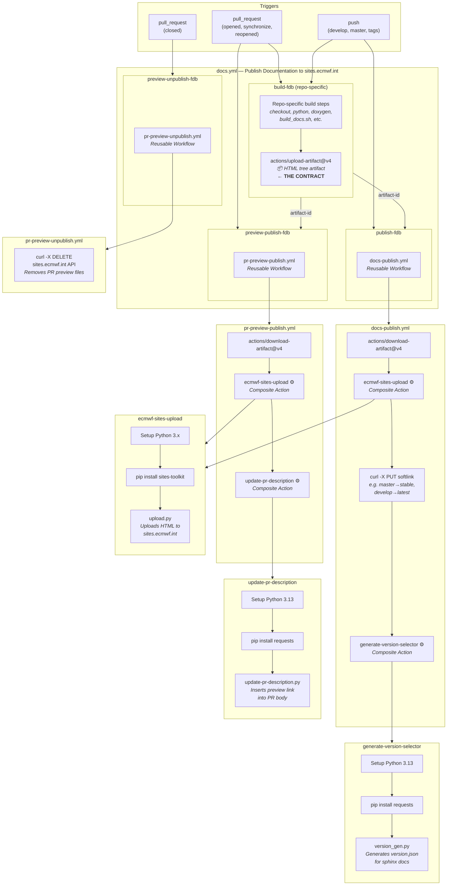

# Documentation Publishing on sites.ecmwf.int

This document describes the setup, use, and available tooling for publishing
documentation to `sites.ecmwf.int`, specifically to
`sites.ecmwf.int/docs/dev-section`.

## Overview of sites.ecmwf.int Support

To support publishing documentation, we maintain a few reusable workflows and
composite actions that can be assembled to build documentation with
PR previews and support for versioned documentation.

The following usage example is taken from FDB's documentation build process.
The `build-fdb` job creates the HTML tree that will be deployed. This forms the
contract between individual projects and the reusable workflows: they expect an
HTML tree and are agnostic to its content.

**FDB Documentation Generation Example:**
```yaml
name: Publish Documentation to sites.ecmwf.int
on:
  pull_request:
    types: [opened, synchronize, reopened, closed]
  push:
    branches:
      - 'develop'
      - 'master'
    tags:
      - '**'
jobs:
  build-fdb:
    if: ${{ github.event_name == 'pull_request' && github.event.action != 'closed' || github.event_name == 'push'}}
    runs-on: ubuntu-latest
    outputs:
      artifact-id: ${{ steps.upload-doc.outputs.artifact-id }}
    steps:
      - name: Checkout
        uses: actions/checkout@v4
      - name: Setup Python
        uses: actions/setup-python@v5
        with:
          python-version: '3.13'
      - name: Install python dependencies
        run: |
          python -m pip install -r docs/requirements.txt
      - name: Prepare Doxygen
        uses: ecmwf/reusable-workflows/setup-doxygen@main
        with:
          version: 1.14.0
      - name: Build doc
        run: |
          DOCBUILD_OUTPUT=docs_out ./docs/build_docs.sh
      - name: Archive documentation
        id: upload-doc
        uses: actions/upload-artifact@v4
        with:
          name: documentation-fdb
          path: docs_out/sphinx
  preview-publish-fdb:
    if: ${{ github.event_name == 'pull_request' && github.event.action != 'closed' }}
    needs: build-fdb
    uses: ecmwf/reusable-workflows/.github/workflows/pr-preview-publish.yml@main
    with:
      artifact-id: ${{ needs.build-fdb.outputs.artifact-id }}
      space: docs
      name: dev-section
      path: fdb/pull-requests
      link-tag: PREVIEW-PUBLISH-FDB
      link-text: 🌈🌦️📖🚧 Documentation FDB 🚧📖🌦️🌈
    secrets:
      sites-token: ${{ secrets.ECMWF_SITES_DOCS_DEV_SECTION_TOKEN }}
  preview-unpublish-fdb:
    if: ${{ github.event_name == 'pull_request' && github.event.action == 'closed' }}
    uses: ecmwf/reusable-workflows/.github/workflows/pr-preview-unpublish.yml@main
    with:
      space: docs
      name: dev-section
      path: fdb/pull-requests
    secrets:
      sites-token: ${{ secrets.ECMWF_SITES_DOCS_DEV_SECTION_TOKEN }}
  publish-fdb:
    if: >-
      ${{ github.event_name == 'push' && (
        github.ref_name == 'develop' ||
        github.ref_name == 'master'  ||
        github.ref_type == 'tag'
      ) }}
    needs: build-fdb
    uses: ecmwf/reusable-workflows/.github/workflows/docs-publish.yml@main
    with:
      artifact-id: ${{ needs.build-fdb.outputs.artifact-id }}
      space: docs
      name: dev-section
      path: fdb
      id: ${{ github.ref_name }}
      softlink: ${{ github.ref_name == 'master'   && 'stable'
                 || github.ref_name == 'develop' && 'latest' }}
    secrets:
      sites-token: ${{ secrets.ECMWF_SITES_DOCS_DEV_SECTION_TOKEN }}
```

Let's look at what the example does in detail:

**preview-publish-fdb:** Uploads the HTML tree to a configurable site and path
on that site. The configured path acts as the root path of all pull-request-related
documentation, i.e. documentation that is created as part of a pull request and
will only be displayed temporarily. The reusable workflow appends
`PR-<number>` to this path to give each pull request a unique URL. Lastly, the
pull request description will be updated with a custom text and a link to the
upload location.

**preview-unpublish-fdb:** Similar to `preview-publish-fdb`, the same path is
computed, but this time the HTML tree is removed from `sites.ecmwf.int`. This
will happen whenever a pull request is closed. The workflow does not update the
pull request description on deletion; the now-broken URL is accepted.

**publish-fdb:** Uploads the HTML tree similarly to `preview-publish-fdb`,
except that it appends the branch or tag name to the path, creates softlinks
from `develop` to `latest` and `master` to `stable`, and updates
`version.json`, which is used to populate the version selector drop-down in
Sphinx themes.

A detailed description of all mentioned reusable workflows and their composite
actions can be found in the [Component Summary](#component-summary) below.


## Architecture

The documentation publishing infrastructure follows a clear
contract:

1. **Each repository** builds its documentation into an HTML tree
   and uploads it as a GitHub Actions artifact (repo-specific —
   uses whatever tools it needs: Sphinx, Doxygen, etc.)
2. **Reusable workflows** take the artifact and handle publishing
   to `sites.ecmwf.int`, PR previews, versioning with softlinks,
   and cleanup

The only thing the reusable infrastructure requires is an
**artifact ID** pointing to a built HTML tree.



### Site Layout

The documentation site `sites.ecmwf.int/docs/dev-section` has the following
structure:

```
.
├── index.html          # Indexes all projects WARNING: maintained manually!
├── project_1/
│   ├── index.html      # Place here once on new projects!
│   ├── version.json
│   ├── pull_requests/  # Not Indexed
│   │   ├── PR-XXX/     # Will be deleted when PR is closed
│   │   └── PR-YYY/     # Will be deleted when PR is closed
│   ├── v1.2.3/         # Indexed through version.json
│   ├── v1.2.4/         # Indexed through version.json
│   ├── develop/        # Indexed through version.json
│   ├── latest/         # Indexed through version.json / Softlink to develop
│   ├── master/         # Indexed through version.json
│   └── stable/         # Indexed through version.json / Softlink to master
└── project_n/ ...      # Same as above

```

The root `index.html` is maintained manually and must be updated when adding a
new project. Each project's `index.html` is simply a redirect to the desired
landing version:

```html
<html>
 <head>
  <meta http-equiv="refresh" content="0; url=latest/" />
 </head>
</html>
```


## Component Summary

This section provides a detailed reference for each reusable workflow and
composite action used in the publishing infrastructure.

### Reusable Workflows

| Workflow                    | Description                                                                       |
|:----------------------------|:----------------------------------------------------------------------------------|
| [pr-preview-publish][rw1]   | Publishes a PR doc preview and adds a link to the PR description                  |
| [pr-preview-unpublish][rw2] | Removes PR preview files when the PR is closed                                    |
| [docs-publish][rw3]         | Publishes versioned docs with optional softlinks and updates the version selector |

[rw1]: https://github.com/ecmwf/reusable-workflows/blob/main/.github/workflows/pr-preview-publish.yml
[rw2]: https://github.com/ecmwf/reusable-workflows/blob/main/.github/workflows/pr-preview-unpublish.yml
[rw3]: https://github.com/ecmwf/reusable-workflows/blob/main/.github/workflows/docs-publish.yml


---


#### `pr-preview-publish.yml`

Downloads a built documentation artifact and publishes it as a PR
preview on `sites.ecmwf.int`, then updates the PR description
with a clickable preview link.

##### How it works

1. Downloads the artifact via `actions/download-artifact@v4`
2. Uploads HTML to sites.ecmwf.int via
   [`ecmwf-sites-upload`](#ecmwf-sites-upload)
3. Updates the PR description via
   [`update-pr-description`](#update-pr-description) using the
   built-in `GITHUB_TOKEN` — the link is inserted between markers
   identified by `link-tag`, so multiple preview links can coexist
   without overwriting each other

> The workflow requires `write` permission on `pull-requests` for
> the `GITHUB_TOKEN` to update PR descriptions.

##### URL structure

```
https://sites.ecmwf.int/<space>/<name>/<path>/PR-<pr-number>/
```

##### Inputs

| Input          | Required | Default       | Description                                    |
|:---------------|:--------:|:-------------:|:-----------------------------------------------|
| `artifact-id`  | yes      | —             | GitHub artifact ID containing the built HTML   |
| `space`        | yes      | —             | sites.ecmwf.int space identifier               |
| `name`         | yes      | —             | Site name within the space                     |
| `path`         | yes      | —             | Path prefix (PR number appended automatically) |
| `link-tag`     | no       | `PREVIEW-URL` | Marker ID in the PR description                |
| `link-text`    | yes      | —             | Display text for the preview link              |

> Use different `link-tag` values when publishing multiple
> previews on the same PR.

##### Secrets

| Secret         | Description                              |
|:---------------|:-----------------------------------------|
| `sites-token`  | Bearer token for the sites.ecmwf.int API |

##### Used by

PR-triggered jobs that need documentation previews
(e.g. `preview-publish-fdb` in `docs.yml`).

##### Usage example

```yaml
preview-publish:
  if: >-
    ${{ github.event_name == 'pull_request'
     && github.event.action != 'closed' }}
  needs: build
  uses: ecmwf/reusable-workflows/.github/workflows/pr-preview-publish.yml@main
  with:
    artifact-id: ${{ needs.build.outputs.artifact-id }}
    space: docs
    name: my-section
    path: my-project/pull-requests
    link-text: "📖 Documentation Preview"
  secrets:
    sites-token: ${{ secrets.MY_SITES_TOKEN }}
```


---


#### `pr-preview-unpublish.yml`

Cleans up PR preview files from `sites.ecmwf.int` when a pull
request is closed (merged or abandoned).

##### How it works

1. Sends a `DELETE` request directly to the sites.ecmwf.int API
   to remove the directory at `<path>/PR-<pr-number>`
2. No composite action is used — it's a single `curl` call for
   minimal overhead

##### API endpoint

```
DELETE https://sites.ecmwf.int/<space>/<name>/s/api/v2/files/<path>/PR-<pr-number>
```

##### Inputs

| Input    | Required | Default | Description                                |
|:---------|:--------:|:-------:|:-------------------------------------------|
| `space`  | yes      | —       | sites.ecmwf.int space (must match publish) |
| `name`   | yes      | —       | Site name (must match publish)             |
| `path`   | yes      | —       | Path prefix (must match publish)           |

##### Secrets

| Secret         | Description                              |
|:---------------|:-----------------------------------------|
| `sites-token`  | Bearer token for the sites.ecmwf.int API |

##### Used by

PR-closed jobs that clean up previews
(e.g. `preview-unpublish-fdb` in `docs.yml`).

##### Usage example

```yaml
preview-unpublish:
  if: >-
    ${{ github.event_name == 'pull_request'
     && github.event.action == 'closed' }}
  uses: ecmwf/reusable-workflows/.github/workflows/pr-preview-unpublish.yml@main
  with:
    space: docs
    name: my-section
    path: my-project/pull-requests
  secrets:
    sites-token: ${{ secrets.MY_SITES_TOKEN }}
```


---


#### `docs-publish.yml`

Publishes versioned documentation to `sites.ecmwf.int`, optionally
creates a softlink alias (e.g. `stable` or `latest`), and
regenerates the Sphinx version selector.

##### How it works

1. Downloads the artifact via `actions/download-artifact@v4`
2. Uploads HTML to `<path>/<id>` via
   [`ecmwf-sites-upload`](#ecmwf-sites-upload)
3. If `softlink` is provided, creates a server-side softlink via
   `PUT` — e.g. `<path>/stable` -> `<path>/v2.1.0`. No content
   is duplicated.
4. Runs [`generate-version-selector`](#generate-version-selector)
   to rebuild `version.json` for the Sphinx version dropdown

##### URL structure

```
Versioned:   https://sites.ecmwf.int/<space>/<name>/<path>/<id>/
Softlinked:  https://sites.ecmwf.int/<space>/<name>/<path>/<softlink>/
```

Example with `path: fdb`, `id: v5.2.0`, `softlink: stable`:

```
.../docs/dev-section/fdb/v5.2.0/   <- concrete version
.../docs/dev-section/fdb/stable/    <- softlink to v5.2.0
```

##### Inputs

| Input          | Required | Default | Description                                        |
|:---------------|:--------:|:-------:|:---------------------------------------------------|
| `artifact-id`  | yes      | —       | GitHub artifact ID containing the built HTML       |
| `space`        | yes      | —       | sites.ecmwf.int space identifier                   |
| `name`         | yes      | —       | Site name within the space                         |
| `path`         | yes      | —       | Base path for documentation                        |
| `id`           | yes      | —       | Version identifier (typically `github.ref_name`)   |
| `softlink`     | no       | —       | Alias to softlink to `<path>/<id>` (e.g. `stable`) |

##### Secrets

| Secret         | Description                              |
|:---------------|:-----------------------------------------|
| `sites-token`  | Bearer token for the sites.ecmwf.int API |

##### Used by

Push-triggered jobs for branches and tags
(e.g. `publish-fdb` in `docs.yml`).

##### Usage example

```yaml
publish:
  if: ${{ github.event_name == 'push' }}
  needs: build
  uses: ecmwf/reusable-workflows/.github/workflows/docs-publish.yml@main
  with:
    artifact-id: ${{ needs.build.outputs.artifact-id }}
    space: docs
    name: my-section
    path: my-project
    id: ${{ github.ref_name }}
    softlink: >-
      ${{ github.ref_name == 'master'  && 'stable'
       || github.ref_name == 'develop' && 'latest' }}
  secrets:
    sites-token: ${{ secrets.MY_SITES_TOKEN }}
```

### Composite Actions

| Action                           | Description                                                           |
|:---------------------------------|:----------------------------------------------------------------------|
| [ecmwf-sites-upload][ca1]        | Uploads an HTML directory tree to sites.ecmwf.int via `sites-toolkit` |
| [generate-version-selector][ca2] | Generates `version.json` for the Sphinx version dropdown              |
| [update-pr-description][ca3]     | Inserts or updates a marked section in a PR description               |

[ca1]: https://github.com/ecmwf/reusable-workflows/tree/main/ecmwf-sites-upload
[ca2]: https://github.com/ecmwf/reusable-workflows/tree/main/generate-version-selector
[ca3]: https://github.com/ecmwf/reusable-workflows/tree/main/update-pr-description


---


#### `ecmwf-sites-upload`

Uploads a local HTML directory tree to `sites.ecmwf.int`. This is
the core upload mechanism used by both `pr-preview-publish` and
`docs-publish`.

##### How it works

1. Sets up Python 3.x via `actions/setup-python@v5`
2. Installs `sites-toolkit` from ECMWF's private package
   repository
3. Runs `upload.py` with the provided configuration — the token
   is passed via environment variable, not a CLI argument

##### Inputs

| Input          | Required | Default | Description                               |
|:---------------|:--------:|:-------:|:------------------------------------------|
| `token`        | yes      | —       | Auth token for sites.ecmwf.int            |
| `path`         | yes      | —       | Local directory containing HTML to upload |
| `remote_path`  | no       | `/`     | Remote destination directory              |
| `space`        | yes      | —       | Site space identifier                     |
| `name`         | yes      | —       | Site name within the space                |

##### Used by

- `pr-preview-publish.yml` — uploads PR preview HTML
- `docs-publish.yml` — uploads versioned documentation HTML


---


#### `generate-version-selector`

Scans all published documentation versions under a given path on
`sites.ecmwf.int` and generates a `version.json` file. Sphinx
themes use this file to render a version dropdown, allowing users
to switch between documentation versions.

##### How it works

1. Sets up Python 3.13 via `actions/setup-python@v5`
2. Installs `requests`
3. Runs `version_gen.py` which queries the sites.ecmwf.int API
   to discover all published versions under `<path>`, then
   writes/uploads `version.json` to the site

##### Inputs

| Input          | Required | Default | Description                                  |
|:---------------|:--------:|:-------:|:---------------------------------------------|
| `path`         | yes      | —       | Directory to scan for version subdirectories |
| `space`        | yes      | —       | Site space identifier                        |
| `name`         | yes      | —       | Site name within the space                   |
| `sites-token`  | yes      | —       | Auth token for reading/writing to the API    |

##### Used by

- `docs-publish.yml` — runs after every publish to keep the
  selector up-to-date


---


#### `update-pr-description`

Inserts or updates a marked section in a pull request's
description via the GitHub API. Uses HTML comment markers
(invisible in rendered markdown) to identify the section, so the
same PR description can hold multiple independently-updated
sections.

##### How it works

1. Sets up Python 3.13 via `actions/setup-python@v5`
2. Installs `requests`
3. Runs `update-pr-description.py` which:
   - Fetches the current PR description via the GitHub API
   - Looks for the marker
     (e.g. `<!-- PREVIEW-PUBLISH-FDB -->`)
   - If found, replaces content between markers; if not,
     appends a new marked section
   - Updates the PR description via the GitHub API

##### Inputs

| Input      | Required | Default | Description                                 |
|:-----------|:--------:|:-------:|:--------------------------------------------|
| `text`     | yes      | —       | Content to insert between markers           |
| `marker`   | yes      | —       | Unique section identifier (from `link-tag`) |
| `repo`     | yes      | —       | Repository in `owner/repo` format           |
| `pr`       | yes      | —       | Pull request number                         |

##### Used by

- `pr-preview-publish.yml` — inserts the documentation preview
  link into the PR description
