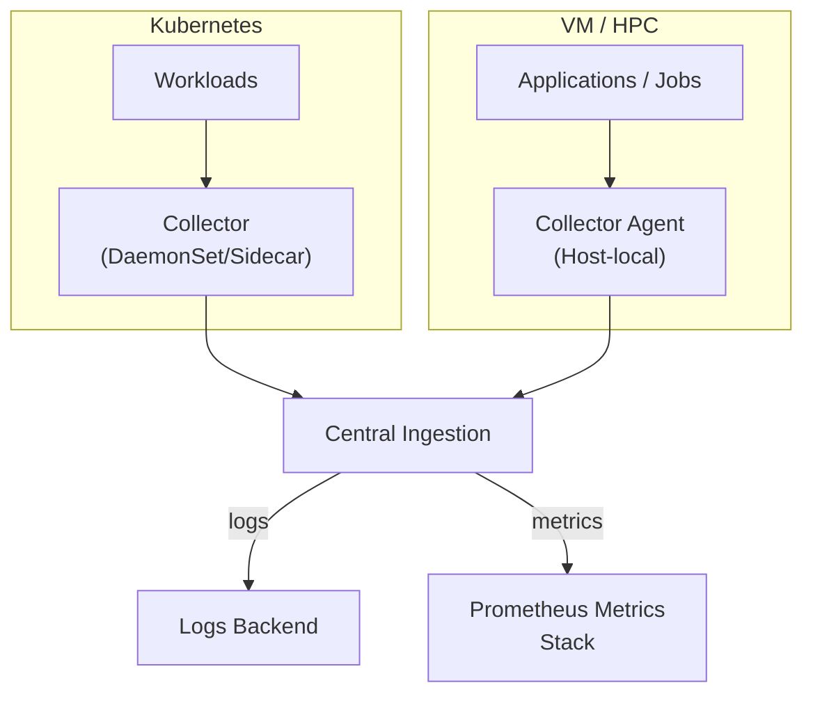

# ECMWF Observability Guidelines

<!-- markdownlint-configure-file
{"MD013":{"code_blocks":false,"tables":false}}
-->

## Table of Contents

- [1. Purpose and Scope](#1-purpose-and-scope)
- [2. Core Principles](#2-core-principles)
  - [2.1 Normative Language](#21-normative-language)
- [3. Platform Context](#3-platform-context)
  - [3.1 High-Level Collection Strategy](#31-high-level-collection-strategy)
- [4. Logging Standard](#4-logging-standard)
  - [4.1 Log Event Model](#41-log-event-model)
  - [4.2 Required Fields (Minimum Contract)](#42-required-fields-minimum-contract)
  - [4.3 Event Naming and Attribute Cardinality](#43-event-naming-and-attribute-cardinality)
  - [4.4 Library vs Binary Application Logging](#44-library-vs-binary-application-logging)
  - [4.5 Good and Bad Log Lines](#45-good-and-bad-log-lines)
    - [4.5.1 Trace Correlation Fields (`trace_id` and `span_id`)](#451-trace-correlation-fields-trace_id-and-span_id)
  - [4.6 Severity and Event Design](#46-severity-and-event-design)
  - [4.7 Exception and Error Logging](#47-exception-and-error-logging)
  - [4.8 Safety and Compliance Rules](#48-safety-and-compliance-rules)
  - [4.9 Common Anti-Patterns](#49-common-anti-patterns)
  - [4.10 Validation Checklist and Ownership](#410-validation-checklist-and-ownership)
- [5. Metrics Standard](#5-metrics-standard)
  - [5.1 Scope and Standard](#51-scope-and-standard)
  - [5.2 References](#52-references)
  - [5.3 Metric Types and Usage](#53-metric-types-and-usage)
  - [5.4 Naming Conventions](#54-naming-conventions)
  - [5.5 Labels and Cardinality](#55-labels-and-cardinality)
  - [5.6 Required Baseline Metrics](#56-required-baseline-metrics)
  - [5.7 Histogram Guidance](#57-histogram-guidance)
  - [5.8 Good and Bad Metric Examples](#58-good-and-bad-metric-examples)
  - [5.9 Validation Checklist and Ownership](#59-validation-checklist-and-ownership)

## 1. Purpose and Scope

This document defines the ECMWF baseline for observability across software and services.

Current scope:

- Defines common expectations for observability signals.
- Defines logging and metrics standardisation.
- Covers all deployment contexts at a principle level:
  - Kubernetes
  - Virtual machines (VMs)
  - HPC

Out of scope in this version:

- Detailed environment-specific collection pipelines and agent deployment patterns.
- Full tracing specification (to be defined in a later revision).

## 2. Core Principles

- Use consistent observability conventions across all ECMWF software.
- Prefer machine-parseable telemetry over free-form text.
- Keep telemetry actionable and low-noise.
- Correlate signals where possible (for example, include trace/span
  identifiers in logs when available).
- Protect sensitive data by design (no credentials, tokens, or personal data
  in logs/metrics/traces).

### 2.1 Normative Language

The keywords `MUST`, `SHOULD`, and `MAY` are used as requirement levels:

- `MUST`: mandatory requirement for compliance.
- `SHOULD`: recommended default; deviations should be justified.
- `MAY`: optional behavior.

## 3. Platform Context

ECMWF software runs in multiple environments:

- Kubernetes clusters
- Virtual machines
- HPC systems

This document focuses on common logs and metrics structure plus application
emission rules. Environment-specific collection design for Kubernetes, VMs,
and HPC will be specified later.

### 3.1 High-Level Collection Strategy

The collection pipeline is part of the deployment environment and MUST be
considered in service design.

- Kubernetes workloads:
  - Platform Engineering Team deploys and operates OpenTelemetry collectors.
  - Workloads emit logs/metrics in the agreed formats.
- VM and HPC workloads:
  - A collector/forwarder SHOULD run alongside the application or on the host.
  - Workloads emit logs/metrics in the agreed formats.
- Central ingestion:
  - Logs are forwarded to the central ECMWF logging backend.
  - Metrics are collected into the central Prometheus-compatible metrics stack.



## 4. Logging Standard

ECMWF software should emit structured logs aligned with the OpenTelemetry
log data model.

Useful references:

- OpenTelemetry logs data model: <https://opentelemetry.io/docs/specs/otel/logs/data-model/>
- OpenTelemetry semantic conventions: <https://opentelemetry.io/docs/specs/semconv/>

### 4.1 Log Event Model

Each log record should contain:

- A clear event message (`body` / message).
- Severity (`severity_text`, `severity_number`).
- Timestamp in UTC.
- Stable resource attributes (service and environment metadata).
- Context attributes for debugging and operations.

Canonical structure (OpenTelemetry-aligned):

```json
{
  "timestamp": "2026-02-11T12:20:43Z",
  "severity_text": "INFO",
  "severity_number": 9,
  "body": "Operation completed",
  "resource": {
    "service.name": "example-service",
    "service.version": "1.0.0",
    "deployment.environment": "prod",
    "k8s.namespace.name": "default",
    "k8s.pod.name": "example-service-7f8b66f9f7-rj8vd"
  },
  "attributes": {
    "event.name": "operation.completed",
    "request.id": "req-8f31c9",
    "job.id": "job-42a7",
    "trace_id": "7f3fbbf5b8f24f32a59ec8ef9b264f93",
    "span_id": "f9c3a29d03ef154f"
  }
}
```

### 4.2 Required Fields (Minimum Contract)

All production logs MUST include the following fields.

Application-emitted fields:

| Field | Requirement | Notes |
| --- | --- | --- |
| `timestamp` | MUST | UTC, RFC 3339 / ISO-8601 format |
| `severity_text` | MUST | `DEBUG`, `INFO`, `WARN`, `ERROR`, `FATAL` |
| `severity_number` | MUST | Numeric OTel-compatible severity |
| `body` | MUST | Human-readable message describing one event |
| `service.name` | MUST | Logical service/application name |
| `service.version` | MUST | Deployed version/build identifier |
| `deployment.environment` | MUST | e.g. `dev`, `test`, `staging`, `prod` |
| `trace_id` | MUST when available | Enables log-trace correlation |
| `span_id` | MUST when available | Enables log-trace correlation |

Collector-enriched or infrastructure fields:

| Field | Requirement | Notes |
| --- | --- | --- |
| `host.name` | MUST (VM/HPC context) | May be emitted by app or added by collector/resource detection |
| `k8s.namespace.name` | MUST (K8s context) | May be added at collection layer |
| `k8s.pod.name` | MUST (K8s context) | May be added at collection layer |

Recommended additional fields:

- `event.name` (stable event type)
- `event.domain` (component/domain group)
- `error.type` and `error.message` for failures
- Request/work item identifiers (for example `request.id`, `job.id`)

### 4.3 Event Naming and Attribute Cardinality

Event naming convention:

- Use `event.name` in the form `domain.action.result`.
- Use lowercase with `.` separators.
- Keep names stable over time.
- If an event meaning changes materially, create a new event name.

Examples:

- `operation.completed`
- `operation.failed`

Attribute cardinality guidance:

- Low to medium cardinality fields are preferred for repeated events.
- Request/job identifiers are allowed for correlation.
- Do not create dynamic field names.
- Do not move arbitrary payloads into attributes.
- Large free-text content SHOULD stay in `body` only when necessary.

### 4.4 Library vs Binary Application Logging

#### Libraries

- MUST not configure global logging policy.
- MUST use the application-provided logger interface.
- MUST emit structured fields, not only formatted strings.
- MUST not log secrets or large payloads.
- SHOULD avoid excessive `INFO`/`DEBUG` logs in hot code paths.
- SHOULD include stable event names for reusable log points:
  - Example: `event.name="library.decode.failed"`
  - Avoid changing field keys between library versions without migration notes.

#### Binary Applications / Services

- MUST own logger initialisation and runtime configuration.
- MUST enforce structured JSON output compatible with OTel pipelines.
- MUST add resource context at startup (`service.*`, environment, runtime metadata).
- MUST define log level policy by environment.
- SHOULD control repetitive low-value log volume.
- MUST implement redaction/masking filters before emission.
- SHOULD ensure resource attributes are complete:
  - `service.name`, `service.version`, `deployment.environment`
  - Runtime and infrastructure attributes when available

### 4.5 Good and Bad Log Lines

Good log line characteristics:

- Structured key/value format.
- One clear event per line.
- Includes identifiers and outcome.
- Uses stable field names.
- Supports correlation:
  - Include `trace_id` and `span_id` when context exists.
  - Include request/job identifiers when available.

Examples below use the same canonical structure as Section 4.1 (`resource`
and `attributes`) for consistency.

#### 4.5.1 Trace Correlation Fields (`trace_id` and `span_id`)

- `trace_id` identifies the full end-to-end request/workflow across services.
- `span_id` identifies one operation within that trace in a single service.
- Multiple log records in one service operation typically share a `span_id`.
- A single `trace_id` usually contains multiple spans across components.
- When tracing context is unavailable (for example offline batch steps),
  these fields MAY be absent.

Bad log line characteristics:

- Free-form text without structure.
- Missing context or identifiers.
- Ambiguous message content.
- Includes sensitive information.
- Breaks schema consistency:
  - Changes field names for the same event type.
  - Encodes structured data only inside a message string.

Good example:

```json
{
  "timestamp": "2026-02-11T12:20:43Z",
  "severity_text": "INFO",
  "severity_number": 9,
  "body": "Operation completed",
  "resource": {
    "service.name": "example-service",
    "service.version": "1.0.0",
    "deployment.environment": "prod",
    "k8s.namespace.name": "default",
    "k8s.pod.name": "example-service-7f8b66f9f7-rj8vd"
  },
  "attributes": {
    "event.name": "operation.completed",
    "request.id": "req-8f31c9",
    "job.id": "job-42a7",
    "trace_id": "7f3fbbf5b8f24f32a59ec8ef9b264f93",
    "span_id": "f9c3a29d03ef154f"
  }
}
```

Bad example:

```text
done request ok
```

Bad example (sensitive data leak):

```text
Login failed for user alice password=PlainTextSecret token=eyJhbGci...
```

### 4.6 Severity and Event Design

- `DEBUG`: development diagnostics and verbose internals.
- `INFO`: normal lifecycle and business-relevant state changes.
- `WARN`: unexpected but recoverable conditions.
- `ERROR`: failed operation requiring attention.
- `FATAL`: unrecoverable condition before shutdown.

Use stable event names (`event.name`) where possible, and make messages
explicit about outcome, target, and reason.

For severity mapping guidance, follow OpenTelemetry severity concepts in the
logs data model:
<https://opentelemetry.io/docs/specs/otel/logs/data-model/#field-severitynumber>

### 4.7 Exception and Error Logging

- Log an exception once at the handling boundary.
- Avoid duplicate logging of the same error in multiple layers.
- Include stack traces when they materially improve diagnosis.
- Sanitize stack traces and exception messages before emission.
- Include `error.type` and `error.message` for failed operations.

### 4.8 Safety and Compliance Rules

- MUST never log secrets, credentials, session tokens, private keys, or
  personal data.
- MUST redact sensitive substrings before writing log output.
- SHOULD avoid full object dumps unless explicitly sanitized.
- SHOULD include stack traces for errors only when useful and sanitized.
- SHOULD define deny-lists and redaction rules centrally:
  - Authentication headers and bearer tokens
  - Passwords, API keys, secrets
  - User personal data fields

### 4.9 Common Anti-Patterns

| Anti-pattern | Why it is harmful | Preferred pattern |
| --- | --- | --- |
| Free-text logs only | Hard to parse, search, and alert | Structured JSON with stable keys |
| Dynamic field names | Breaks queries and dashboards | Stable schema and key names |
| Logging in tight loops at `INFO` | Noise and cost explosion | Reduce frequency and log only meaningful state changes |
| Duplicate exception logs across layers | Inflates incident noise | Log once at handling boundary |
| Logging secrets/tokens | Security and compliance risk | Redaction and explicit deny-lists |

### 4.10 Validation Checklist and Ownership

Before release, teams should verify:

- Required fields are present in production logs.
- Log output is valid structured JSON.
- Secrets and sensitive data are redacted.
- Library and binary responsibilities are correctly separated.
- Severity levels are used consistently.
- Correlation fields (`trace_id`, `span_id`) are present when tracing context exists.

Ownership split for compliance:

| Control | App Team | Platform Team |
| --- | --- | --- |
| Structured JSON emitted by app | MUST | N/A |
| Required app fields (`service.name`, `service.version`, `deployment.environment`, `body`, severity) | MUST | Validate only |
| Secret redaction in app logs | MUST | SHOULD add defensive redaction in pipeline |
| `k8s.namespace.name`, `k8s.pod.name`, `host.name` enrichment | MAY | MUST where collector supports it |
| Log transport to backend (for example Splunk) | N/A | MUST |
| Parsing/schema validation in collector | N/A | SHOULD |
| Log noise and volume control | SHOULD at source | SHOULD as safety net |

## 5. Metrics Standard

Metrics MUST be exposed in Prometheus/OpenMetrics-compatible format.
ECMWF services MUST use Prometheus metric types and naming conventions, and
MUST expose metrics in a Prometheus/OpenMetrics-compatible text format.
Metrics defined in this section are the source for alerting rules defined in
the Alerting section.

### 5.1 Scope and Standard

- This section defines instrumentation expectations, metric schema, and
  quality requirements.
- Environment-specific scrape/discovery designs for Kubernetes, VMs, and HPC
  are specified separately.
- Metrics exposure and collection at a high level:
  - HTTP services SHOULD expose a `/metrics` endpoint owned by the service.
  - Non-HTTP and batch/HPC workloads MUST still expose Prometheus-compatible
    metrics, typically via a local collector/forwarder integration.
  - Platform Engineering Team owns central scrape and ingestion configuration.

### 5.2 References

- Prometheus metric types: <https://prometheus.io/docs/concepts/metric_types/>
- Prometheus naming best practices: <https://prometheus.io/docs/practices/naming/>
- OpenMetrics specification:
  <https://github.com/OpenObservability/OpenMetrics/blob/main/specification/OpenMetrics.md>

### 5.3 Metric Types and Usage

- `Counter`:
  - MUST be monotonic.
  - MUST use `_total` suffix.
  - Use for counts of events and outcomes.
- `Gauge`:
  - Use for values that increase and decrease (for example in-flight operations).
- `Histogram`:
  - SHOULD be used for latency and size distributions.
  - MUST have stable bucket boundaries for the same metric across instances.
- `Summary`:
  - SHOULD be avoided for cross-instance aggregation use cases.
  - MAY be used only with clear justification.

### 5.4 Naming Conventions

- Metric names MUST be lowercase `snake_case`.
- Metric names MUST include base units where applicable:
  - `_seconds` for duration
  - `_bytes` for size
  - `_total` for counters
- Metric names SHOULD be stable over time.
- If a name must change, introduce the new metric and deprecate the old one
  before removal.

Good naming examples:

- `http_server_requests_total`
- `http_server_request_duration_seconds`
- `job_execution_duration_seconds`
- `process_resident_memory_bytes`

Bad naming examples:

- `HttpRequests`
- `requestDurationMs`
- `errors`

### 5.5 Labels and Cardinality

Labels add dimensionality to metrics but increase cardinality.

- Labels MUST use stable keys and bounded value sets.
- Labels SHOULD describe dimensions such as:
  - `service`
  - `environment`
  - `operation`
  - `status`
- Labels MUST NOT include unbounded identifiers such as:
  - `request_id`
  - `user_id`
  - Raw URLs with path parameters
  - UUIDs or timestamps
- Label values SHOULD be normalized:
  - Prefer route templates (for example `/api/v1/items/{id}`) over raw paths.
  - Prefer status classes (`2xx`, `4xx`, `5xx`) when detail is not required.

### 5.6 Required Baseline Metrics

Application and service metrics:

- Request/operation throughput counter
  - Example: `service_requests_total`
- Request/operation failure counter
  - Example: `service_request_failures_total`
- Request/operation duration histogram
  - Example: `service_request_duration_seconds`
- In-flight operation gauge (if applicable)
  - Example: `service_requests_in_flight`

Runtime/process metrics (where runtime supports them):

- CPU usage
- Memory usage
- Uptime/start time
- Runtime-specific health metrics (for example GC metrics)

Batch/HPC job metrics (where applicable):

- Job execution count by outcome
- Job execution duration
- Queue/wait duration

### 5.7 Histogram Guidance

- Histogram bucket boundaries SHOULD align with SLO/SLA objectives.
- Bucket sets MUST remain consistent for the same metric across services and versions.
- Bucket count SHOULD be limited to a practical set to control cost and query complexity.

Example bucket set for service latency metric:

- `0.005`, `0.01`, `0.025`, `0.05`, `0.1`, `0.25`, `0.5`, `1`, `2.5`, `5`,
  `10` seconds

### 5.8 Good and Bad Metric Examples

Good examples:

```text
service_requests_total{service="example-service",environment="prod",operation="create",status="2xx"} 12842
service_request_duration_seconds_bucket{service="example-service",environment="prod",operation="create",le="0.5"} 12011
service_request_duration_seconds_sum{service="example-service",environment="prod",operation="create"} 3184.22
service_request_duration_seconds_count{service="example-service",environment="prod",operation="create"} 12842
```

Bad examples:

```text
requests{request_id="d9fd0f7a-3d8e-4c17-9d8b-9b57f43dc40e",user_id="483992"} 1
requestDurationMs{path="/api/v1/items/123456"} 187
```

### 5.9 Validation Checklist and Ownership

Before release, teams should verify:

- Metric names, units, and suffixes are compliant.
- Required baseline metrics are present.
- Label keys and values are bounded and normalized.
- No high-cardinality identifiers are emitted as labels.
- Histogram buckets are defined and justified.

Ownership split for compliance:

| Control | App Team | Platform Team |
| --- | --- | --- |
| Instrument required baseline metrics | MUST | N/A |
| Naming and unit compliance | MUST | SHOULD validate |
| Label cardinality discipline | MUST | SHOULD enforce guardrails |
| Scrape/discovery pipeline configuration | N/A | MUST |
| Central metric relabeling and hygiene checks | N/A | SHOULD |
| Cost and cardinality monitoring at platform level | N/A | SHOULD |
